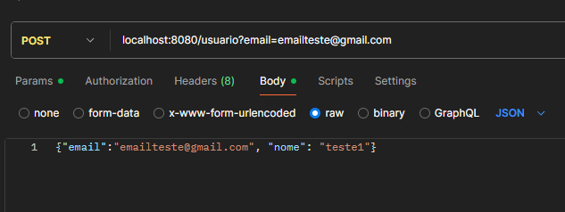
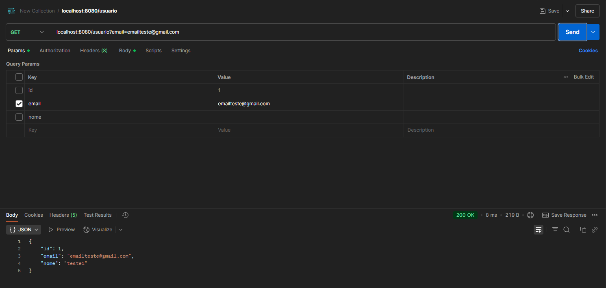
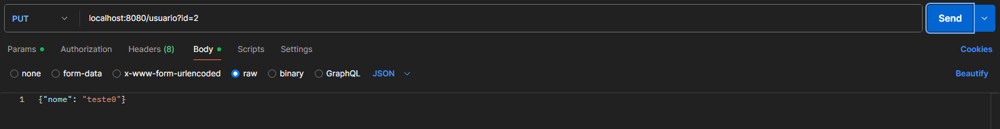
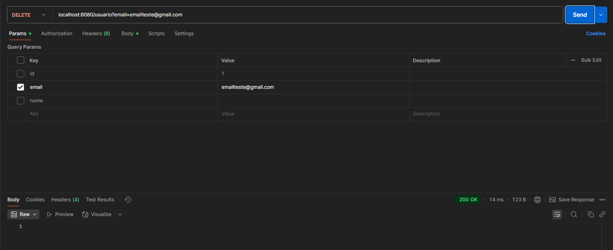

Sistema simples CRUD em Java, utilizando Spring Boot e Postman!

O sistema funciona de forma simples, ao executar uma função bem sucedida, o postman devolve 200 "ok", 400 "Bad Request" ou 500 "Internal Server Error".

> Imagens do funcionamento do sistema:  

### Cadastro utilizando o "Get" do postman:  

### Procurando o usuário pelo email utilizando o método "Post":  

### Atualizando o nome de usuário pelo método "Put":  

### Deletando o usuário pelo email:  

